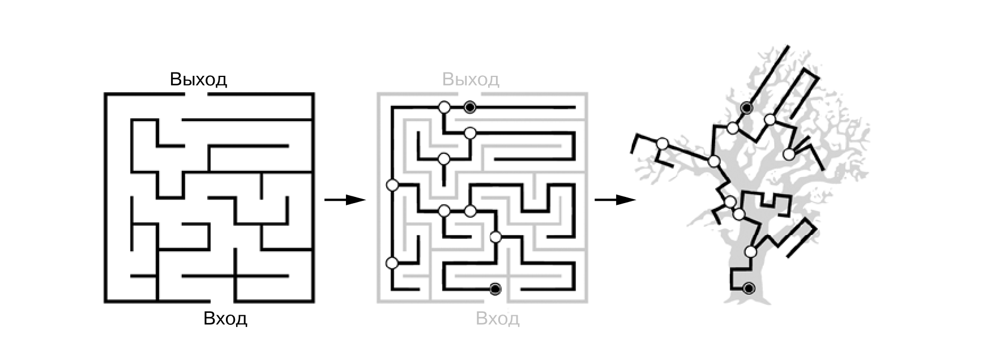
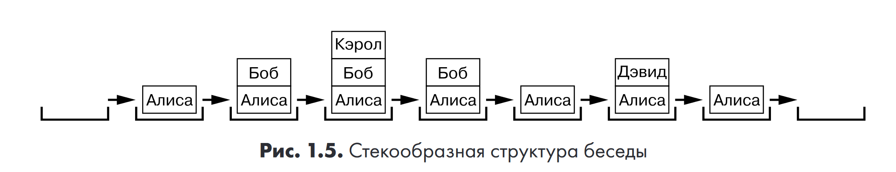
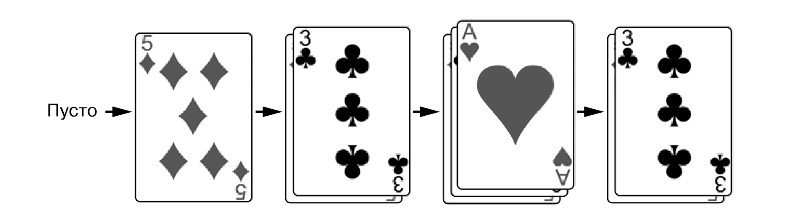
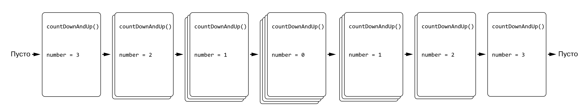
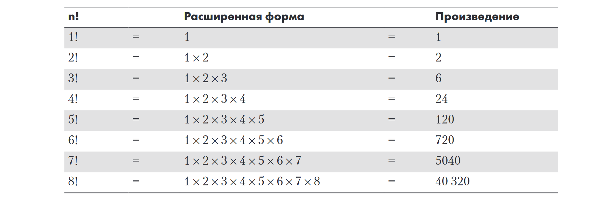
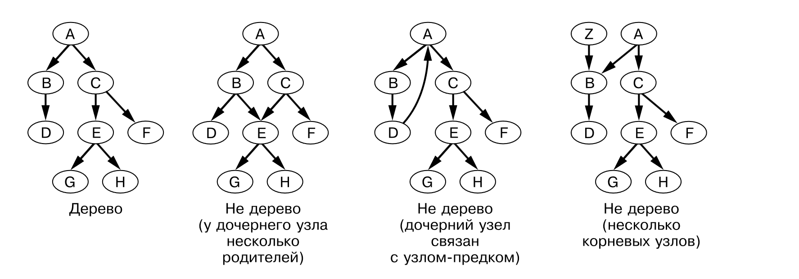
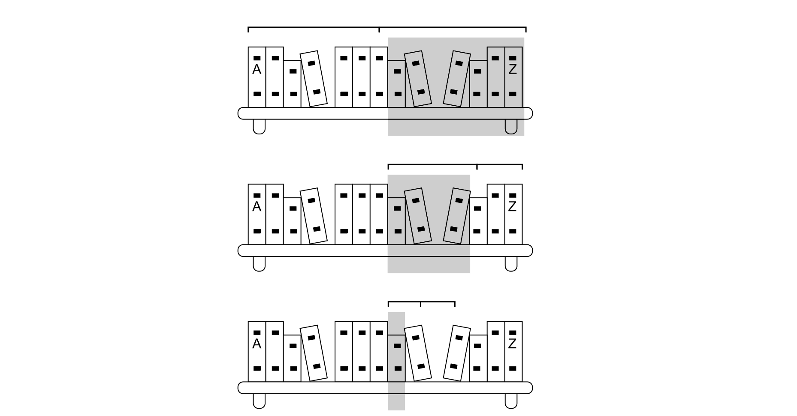
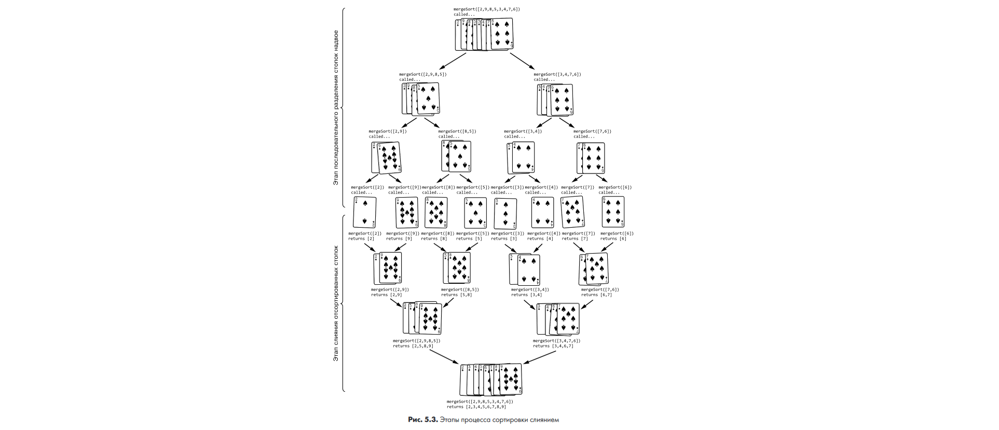

# Свейгарт Эл - Рекурсивная книга о рекурсии (Серия Библиотека программиста) - 2023

## Вступление:
> __Доктор технических наук Джон Виландер (John Wilander) однажды сказал:__  
> «Когда вы получаете докторскую степень в области computer science, вас отводят в специальную комнату и просят 
> никогда не использовать рекурсию в реальной жизни, поскольку ее главная цель — усложнить жизнь старшекурсникам».

> __Прежде чем начать, я предлагаю вспомнить самые распространенные шутки прорекурсию, начиная со следующей:__  
> «Чтобы понять рекурсию, надо сначала понять рекурсию».

## Определения стека, рекурсии, базового и рекурсивного случая:
> __Функция:__ Функции можно рассматривать как мини-программы внутри основной программы.  
> Во всех языках программирования функции имеют четыре характеристики.
> 1. Функции содержат код, который выполняется при их вызове.
> 2. В момент вызова функции ей передаются аргументы (то есть значения). Это входные данные для функции, количество 
> которых может варьироваться от нуля до бесконечности.
> 3. Функции возвращают так называемое возвращаемое значение, которое представляет собой вывод функции. Правда, некоторые
> языки программирования позволяют функциям возвращать как нулевые значения, так и ничего вроде undefined или None.
> 4. Программа запоминает строку кода, в которой была вызвана функция, и возвращается к ней, когда функция завершает свое выполнение.

> __Рекурсия:__ рекурсивным называется объект, определение которого включает само себя. То есть этот объект имеет 
> самозамкнутое определение. В контексте программирования рекурсивной называется функция, которая вызывает сама себя.
> 
> Все рекурсивные функции должны предусматривать по крайней мере один базовый и один рекурсивный случай. При отсутствии 
> первого функция никогда не перестанет вызывать саму себя, что в конечном итоге приведет к переполнению стека.
> При отсутствии второго функция никогда не вызовет саму себя и будет обычной, а не рекурсивной функцией. При написании 
> рекурсивных функций сначала следует подумать о базовом и рекурсивном случаях.
> 
> __Рекурсивный случай:__ это cитуация, в которой функция рекурсивно вызывает саму себя, называется `рекурсивным случаем`.
> 
> __Базовый случай:__ набор обстоятельств, при которых функция перестает вызывать саму себя и просто возвратится, `называется базовым случаем`.

>__Когда нужно использовать рекурсию?__ Рекурсивный подход может быть особенно полезен, если задача имеет следующие три особенности:
> - у нее древовидная структура;
> - она предусматривает поиск с возвратом;
> - она не предполагает слишком большую глубину рекурсии, способную спровоцировать переполнение стека.

> Структура дерева обладает свойством самоподобия: точки ветвления напоминают корень меньшего поддерева. Рекурсия часто 
> имеет дело с самоподобием и задачами, которые можно разделить на более мелкие. Корень дерева аналогичен первому вызову 
> рекурсивной функции, точки ветвления — рекурсивным случаям, а листья — базовым случаям, в которых рекурсивные вызовы 
> перестают выполняться.
> 

> Лабиринт — это еще один хороший пример задачи, имеющей древовидную структуру и предусматривающей поиск с возвратом. 
> В лабиринте развилки соответствуют точкам ветвления, а тупик — базовому случаю, по достижении которого вы должны
> вернуться к предыдущей точке ветвления, чтобы выбрать другой путь.
> 

> __Стек вызовов:__ это структура данных типа LIFO, что означает «последним пришел — первым ушел» (last in, first out) 
> которая контролирует ход выполнения программы.
> 
> Стек представляет собой одну из простейших структур данных в информатике. Как и список, он хранит несколько значений, 
> но позволяет добавлять или удалять значения только «сверху». Для стеков, реализованных с помощью списков или массивов,
> «верхним» является последний элемент в правом конце списка или массива. Добавление значений в стек называется 
> проталкиванием (pushing), а извлечение — выталкиванием (popping). Стек вызовов программы, или просто стек,
> представляет собой объекты, называемые кадрами. Они содержат информацию об одном вызове функции, в том числе о строке 
> кода, с которой должно продолжиться выполнение программы после завершения функции. Кадры создаются и помещаются в стек 
> при вызове функции. Кадры содержат следующие элементы:
> - адрес возврата или точку, с которой должно продолжиться выполнение программы после возврата из функции;
> - аргументы, передаваемые в функцию при ее вызове;
> - набор локальных переменных, созданных во время вызова функции.
> 
> 
> 

> __Переполнением стека:__ Многократные вызовы функций без возврата увеличивают стек вызовов до тех пор, пока не будет 
> израсходована вся выделенная для него память компьютера. Такая ошибка называется переполнением стека или stack overflow.
> >  Именно в ее честь был назван популярный сайт https://stackoverflow.com).
> 
> Такой предел называется максимальной глубиной рекурсии или максимальным размером стека вызовов. В Python граничным 
> значением считается 1000 вызовов функций. В случае с JavaScript максимальный размер стека вызовов уже зависитот браузера, 
> в котором выполняется код, но обычно составляет не менее 10 000. Переполнение стека происходит, когда он становится 
> «слишком высоким» (то есть потребляет слишком много памяти компьютера). Переполнение стека можно предотвратить с 
> помощью так называемого базового случая, речь о котором пойдет далее.
> 

## Рекурсивные и итеративные алгоритмы

> Часто в учебниках по программированию приводятся примеры рекурсивных алгоритмов вроде последовательности Фибоначи, вычисления
> факториала, или возведения в степень, однако такие реализации являются ненадежными так как подвержены ошибкам переполнения
> стека. Существуют так же итеративные вариации которые используют циклы вместо рекурсии. Такие алгоритмы обычно работают
> быстрее, не вызывают переполнение стека, но являются менее элегантными, а так же в некоторых случаях состоят из
> вложенных циклов, что тоже является плохой практикой.
> 
> Рекурсивный алгоритм всегда можно преобразовать в итеративный. Вместо многократного вызова рекурсивных функций для 
> повторяющихся вычислений лучше использовать цикл. Стек вызовов, используемый рекурсивными функциями, в итеративном 
> алгоритме можно заменить стековой структурой данных. Таким образом, любой рекурсивный алгоритм может быть преобразован
> в итеративный с помощью цикла и стека.

> __Факториал:__ Факториал целого числа (назовем его n) — это произведение всех целых чисел от 1 до n. Например,
> факториал числа 4 — это 4 × 3 × 2 × 1, или 24. Восклицательный знак — это математическое обозначение факториала, то есть
> выражение 4!, означает факториал числа 4. Факториалы используются во всевозможных видах расчетов, например при 
> определении количества вариантов перестановок чего-либо.
> 
> 
> 
> Чем плох рекурсивный алгоритм вычисления факториала ?
> 
> Если вы захотите вычислить факториал числа 1001, вам придется рекурсивно вызвать функцию factorial() 1001 раз. 
> Ваша программа, скорее всего, аварийно завершится в связи с переполнением стека, потому что такое количество вызовов функций 
> без возврата, вероятно, превысит максимальный размер стека вызовов интерпретатора. 
> Никогда не используйте рекурсивный алгоритм вычисления факториала в реальном коде — это ужасно.

> __Последовательность Фибоначчи:__ начинается с чисел 1 и 1 (иногда с 0 и 1). Каждое последующее число в этой 
> последовательности представляет собой сумму двух предыдущих.
> 
> Чем плох рекурсивный алгоритм вычисления чисел Фибоначчи ?
> 
> Он имеет критический недостаток в виде многократного повторения одних и тех же вычислений. На рисунке показано, как вызов
> функции fibonacci(6), отмеченной на древовидной диаграмме, вызывает функции fibonacci(5) и fibonacci(4).
> Это порождает каскад вызовов других функций, которые выполняются вплоть до достижения базовых случаев fibonacci(2) и 
> fibonacci(1), возвращающих значение 1. Однако обратите внимание, что функция fibonacci(4) вызывается дважды, 
> fibonacci(3) — трижды и т. д. Эти лишние вычисления замедляют работу алгоритма, а эффективность падает по мере увеличения
> числа Фибоначчи, которое вы хотите вычислить. Если итеративный алгоритм способен найти число fibonacci(100) менее чем 
> за секунду, то рекурсивному алгоритму на это потребуется более миллиона лет.
> 
> 

> __Вычисление экспоненты:__ это алгоритм вычисляет значение 𝑎**𝑏, где 𝑎 — основание, а 𝑏 — показатель степени. 
> Этот алгоритм может быть реализован с использованием различных методов, включая простую итерацию или рекурсию.
>
> Обычный рекурсивный алгоритм является коротким, и понятным, но в случае вычисления степени большей 1000 будет бесполезен
> так как спровоцирует переполнения стека.
> Итеративный алгоритм тоже является коротким, а еще он быстрее чем рекурсивны, однако существует метод улучшения базового
> алгоритма.
> 
> В силу сочетательного свойства операции умножения выражение 3 × 3 × 3 × 3 × 3 × 3 равнозначно (3 × 3 × 3) × (3 × 3 × 3) или (3 × 3 × 3)^2. 
> А поскольку (3 × 3 × 3) то же самое, что и 3^3, то 3^6 можно представить как (3^3)^2. В математике это называется возведением 
> степени в степень: (a^m)^n = a^mn. При умножении степеней с одинаковыми основаниями действует следующее правило: 
> a^n × a^m = a^(n + m) (в том числе a^n × a = a^(n + 1)).
> Такой подход работает для четных показателей, а как насчет нечетных? Если бы нам потребовалось посчитать 3^7, или 
> 3 × 3 × 3 × 3 × 3 × 3 × 3, это было бы равнозначно вычислению (3 × 3 × 3 × 3 × 3 × 3) × 3 или (3^6) × 3. А для определения 3^6 мы можем
> использовать тот же рекурсивный вызов

## Алгоритмы поиска с возвратом и обхода дерева 4
> __Древовидная структура данных:__ состоит из узлов (или вершин), соединенных ребрами. Ребра определяют взаимосвязи 
> между узлами, которые, в свою очередь, содержат данные. Начальный узел дерева называется корнем, а конечные — листьями.
> У деревьев может быть только один корень. Родительские узлы соединены ребрами с дочерними и не являются листьями. Таким 
> образом, листья — это вершины, у которых нет дочерних узлов.
> 
> 

> __Прямой обход дерева:__ рекомендуется использовать, если вашему алгоритму необходимо получить доступ к данным в 
> родительских узлах перед получением данных, хранящихся в их дочерних узлах.

> __Обратный обход дерева:__ предполагает обход потомков перед получением доступа к данным узла. Этот алгоритм используется, 
> например, при удалении дерева и гарантирует, что ни одна дочерняя вершина не «осиротеет» из-за удаления предков, став
> недоступной для корневого узла.

> __Поиск в глубину:__ 

> __Глубина узла:__ определяется количеством ребер, находящихся между ним и корнем. 

## Классические рекурсивные алгоритмы

> __Алгоритмы разделяй и властвуй:__ разбивают крупные задачи на более мелкие вплоть до таких, которые предполагают 
> тривиальное решение. Данный подход идеально сочетается с рекурсией: рекурсивный случай разделяет задачу на самоподобные
> подзадачи, а базовый случай соответствует самой маленькой из них, решение которой является тривиальным.  Одно из 
> преимуществ описываемого подхода состоит в том, что получившиеся фрагментарные задачи можно решать параллельно, 
> используя несколько ядер центрального процессора (ЦП) или компьютеров.

> __Двоичный (или бинарный) поиск:__ это тип поискового алгоритма, который последовательно делит пополам заранее отсортированный 
> массив (список), чтобы обнаружить нужный элемент. Самый непредвзятый способ поиска из нашего примера заключается в том, 
> что бы начать с книги в середине, а затем выяснить, с какой стороны от нее находится искомая книга.
> 

> __Быстрая сортировка:__ это рекурсивный алгоритм сортировки, разработанный Тони Хоаром в 1959 году. Он основан на методе 
> «разделяй и властвуй» и работает следующим образом:
> 
> - Выбор опорного элемента: Выберите один элемент из массива, который будет использоваться в качестве опорного 
> (чаще всего это первый, последний или случайный элемент). 
> - Разбиение: Переставьте элементы массива так, чтобы все элементы, меньшие опорного, оказались слева от него, а все большие — справа. 
> - Рекурсия: Рекурсивно примените тот же процесс к левому и правому подмассивам (которые находятся по обе стороны от опорного элемента). 
> 
> В результате, когда массив будет разбит на мелкие части, каждая из них станет отсортированной, и весь массив будет отсортирован. 
> Быстрая сортировка эффективна и имеет среднюю сложность 𝑂(𝑛 log 𝑛).
> 

> __Сортировка слиянием:__ Математик Джон фон Нейман разработал алгоритм сортировки слиянием в 1945 году. Данный алгоритм 
> использует подход «разделение — слияние»: каждый рекурсивный вызов функции mergeSort() делит неотсортированный список 
> пополам до тех пор, пока длина списков не достигает нуля или единицы. Затем, по мере возврата из рекурсивных вызовов,
> эти маленькие списки объединяются в один большой и отсортированный. После возврата из последнего рекурсивного вызова 
> весь список оказывается отсортированным.
> 

> __Суммирование массива целых чисел:__ алгоритм возвращает сумму всех чисел в массиве. Этот алгоритм можно реализовать
> при помощи метода "голова и хвост". Массив разбивается на два подмассива, где голова это первый элемент массива
> а хвост оставшийся подмассив.

> __Палиндромом:__ называют слово или словосочетание, одинаково читающееся в обе стороны.
> `Довод, заказ, осело колесо, а роза упала на лапу Азора` — все это примеры палиндромов. 

## VII Мемоизация

> __Мемоизация:__ это метод запоминания значений, возвращаемых функцией при передаче ей конкретных аргументов. Кэшируя ранее 
> вычисленные результаты, мемоизация ускоряет работу алгоритма за счет увеличения объема используемой памяти. 
> Например, если вы вычисляете число Фибоначчи для n=5, а затем снова запрашиваете его, мемоизация позволяет быстро вернуть уже 
> вычисленное значение, тем самым ускоряя выполнение программы за счёт использования дополнительной памяти.
>
> Древовидная диаграмма рекурсивных вызовов функций, начиная с fibonacci(6). Избыточные вызовы выделены серым цветом.
> 

> __Модуль Python functools:__ Стандартная библиотека Python предусматривает модуль functools с декоратором функций @lru_cache(), 
> который автоматически мемоизирует декорируемую им функцию. В синтаксисе Python это означает добавление фрагмента @lru_cache()
> в строку, предшествующую инструкции def. эш обычно имеет ограничения на размер используемой памяти. Фрагмент lru в имени 
> декоратора расшифровывается как least recently used и означает, что при заполнении кэша до предела новые записи заменяют 
> собой в первую очередь те значения, которые дольше всего не запрашивались. 

## VIII Оптимизация хвостовых вызовов

> __Оптимизацией хвостовых вызовов:__ используется компилятором или интерпретатором для предотвращения переполнения стека.
> Оптимизацию хвостовых вызовов также называют устранением хвостовых вызовов или устранением хвостовой рекурсии.
> Чтобы воспользоваться оптимизацией хвостовых вызовов, функция должна предусматривать хвостовую рекурсию, при которой 
> рекурсивный вызов является последней операцией перед возвратом из функции.

> __Аккумуляторы в контексте хвостовой рекурсии:__ это параметр функции, который сохраняет промежуточный результат вычисления 
> при рекурсивных вызовах, позволяя обойти ограничения хвостовой рекурсии, связанные с использованием локальных переменных. 
> Он позволяет более эффективно вычислять значения, возвращая итоговый результат без необходимости дожидаться завершения всех рекурсивных вызовов.

> __Ограничения хвостовой рекурсии:__ Однако не все компиляторы и интерпретаторы предусматривают такую функцию. Например, 
> CPython (интерпретатор Python, загружаемый с сайта https://python.org) не реализует оптимизацию хвостовых вызовов.Даже 
> если вы пишете свои рекурсивные функции так, что рекурсивный вызов становится их последней операцией, это не убережет 
> вас от переполнения стека, которое неминуемо произойдет после выполнения достаточно большого количества вызовов.
> Кроме того, оптимизация хвостовых вызовов, скорее всего, никогда не будет реализована в CPython. Гвидо ван Россум, 
> создатель языка Python, объяснил, что оптимизация хвостовых вызовов может усложнить отладку программ, так как удаляет
> кадры из стека вызовов вместе с содержащейся в них отладочной информацией.

## IX Рисование фракталов

> __Фракталы:__ это формы, которые повторяют сами себя, иногда хаотично, в разных масштабах. Сам термин был введен в 1975 
> году создателем фрактальной геометрии Бенуа Б. Мандельбротом и происходит от латинского слова fr ctus — то есть 
> «разбитый» или «треснувший» (как в случае разбитого стекла).

> __Процедурная генерация:__ при создании фильмов и видеоигр эти рекурсивные алгоритмы могут использоваться в рамках так 
> называемой процедурной генерации, позволяющей автоматически, а не вручную создавать 3D-модели различных объектов: 
> деревьев, папоротников, цветов и других растений. С помощью алгоритмов компьютеры быстро генерируют целые леса, 
> состоящие из миллионов уникальных деревьев, освобождая от этой работы 3D-художников.

